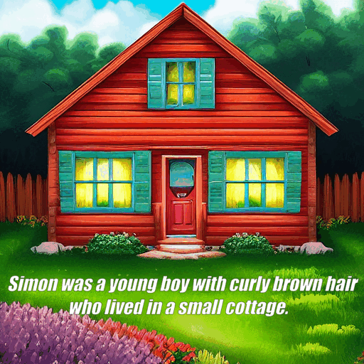
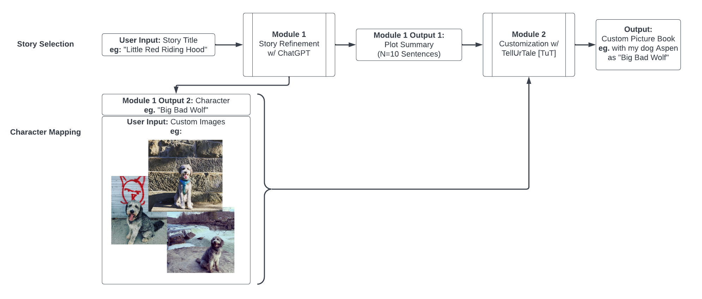

# Tell-Ur-Tale (TuT)
###### Chosen for "Audience Choice Award" 🥇
**Image Synthesis project: Customize storybooks** A pipeline from pretrained foundation models that are customized with 3-5 images and a
text prompt given by the user to output a visual narrative.



## Motivation
Recent advancements in generative models and LLMs, such as Stable Diffusion and ChatGPT, have ushered in a new
wave of excitement for AI. We want to leverage this technology to enable applications that, up until recently, might
have seemed like magic.
We will focus on creating illustrations for a chosen story, where the main character(s) of the plot can be customized
to the user’s liking. By using user input to inform the story’s title and characters, our system allows people to see
themselves in the stories they read and to explore their own imagination. Our goal is to obtain the best results possible,
which means leveraging pretrained foundation models as much as we can and exploring SOTA image editing methods
for customization. The result will be a cohesive, compelling illustrated story where anyone can be the protagonist.

## Overview

Our end product is a live demo that can generate a custom illustrated storybook. The inputs will be a story title and
seed images for character customization. The output will be generated illustrations that tell a beautiful, coherently
styled story. If time permits, we can implement other extensions, such as multiple character customization and style
customization.

## How to use
### Step 1: generate a story
run without illustrator, story saved to `output/jack_and_the_beanstalk/story.txt`
```sh
python tut.py --title "Jack and the Beanstalk" --orig_name Jack --config_path config/story-only.yml
```
run with an uncustomized illustrator, story saved to `output/jack_and_the_beanstalk/story.txt`
```sh
python tut.py --title "Little Red Riding Hood" --orig_name "Little Red Riding Hood" --config_path config/openjourney.yml
```

### Step 2: customize model
change jack to simon but with generic `orig_name`, specific `custom_name`, and generic character description
```sh
python illustrator.py \
    --orig_object "boy" \
    --orig_name "Jack" \
    --custom_name Simonstasta \
    --custom_img_dir "sample_images/simon_512" \
    --prompts_path output/jack_and_the_beanstalk/story.txt \
    --config_path "config/text-encoder-mixed-precision-prior-preserve.yml" \
```

### Step 3: generate custom images
use trained customization model to generate images
```sh

python illustrator.py \
    --orig_name "Jack" \
    --custom_name Simonstasta \
    --prompts_path output/jack_and_the_beanstalk/story.txt \
    --config_path "config/text-encoder-mixed-precision-prior-preserve.yml"
    --skip_training
```

### Entire pipeline at once
```sh
python tut.py \
    --title "Jack and the Beanstalk" \
    --orig_object "boy" \
    --orig_name "Jack" \
    --custom_name Simonstasta \
    --custom_img_dir "sample_images/simon_512" \
    --config_path "config/text-encoder-mixed-precision-prior-preserve.yml"
```

## Method

### Story Refinement and Prompt Generation
We will be relying on ChatGPT or opensource alternatives like OPT [6] for story generation, and use prompts such as:
“Summarize the plot of ‘Lord of the Rings’ in ten sentences. Tell it to me like a children’s story.” This will output ten
sentences that can be used as prompts in the text-to-image generation process.

### Image Generation
We will use the best-open-sourced text-to-image model (Stable Diffusion [4]) to generate images from text prompts
that describe the story plot.

### Customization
We will utilize existing techniques such as DreamBooth [5], Textual Inversion [2], Custom Diffusion for multiple-
concepts [3], and InstructPix2Pix[1]. We will experiment with each method to see what works best for our intended
usage. Below we share some initial hypotheses based on the literature.
DreamBooth and Custom Diffusion are particularly useful for character customization, as they allows for model fine-
tuning to generate images that are not only similar but also adjust to new context, and thus can most accurately depict
characters provided by the user.
On the other hand, image-guided Textual Inversion tries to reconstruct the input from its prior distribution. Objects or
backgrounds of the scene may benefit from the resulting diversity of Textual Inversion, but for inserting main charac-
ters with recognizable faces, it may not work as well as methods mentioned above.
Another model worth considering for image customization is InstructPix2Pix[1]. This particular model has the ability
to create images even when a full description isn’t provided. One notable feature of InstructPix2Pix is that it allows
users to input real images and only a simple instruction to get the corresponding results.

### Page Consistency
We want to ensure that the overall style of images in the storybook stays consistent. This could be approached in three
ways (from easy to difficult). (1) tell our text-to-image model to generate in a particular style, forcing consistency
across pages (2) generate each image and provide the first generated image or a user provided image as a reference
style image, or (3) train a style consistency loss over all of the images.

### Dataset
The overall goal of this project is to create a pipeline from pretrained foundation models that are customized with
3-5 images and a text prompt given by the user to output a visual narrative. This will be possible because each of
the image generation algorithms we consider (DreamBooth, Textual Inversion, or Custom Diffusion) only requires a
handful images. We will gather four sets of images for development: photos of each of the three authors and a dog.

### Limitations and Concerns
Some practical concerns include computing power required by each customization model and inference time required
during the demo. To handle the second concern, we can process in an async manner and email with the finished
product when finished.

## References
- [1] Tim Brooks, Aleksander Holynski, and Alexei A. Efros. InstructPix2Pix: Learning to Follow Image Editing
Instructions. 2023. arXiv: 2211.09800 [cs.CV].
- [2] Rinon Gal et al. An Image is Worth One Word: Personalizing Text-to-Image Generation using Textual Inversion. 2022. DOI: 10.48550/ARXIV.2208.01618. URL: https://arxiv.org/abs/2208.01618.
- [3] Nupur Kumari et al. “Multi-Concept Customization of Text-to-Image Diffusion”. In: CVPR. 2023.
- [4] Robin Rombach et al. “High-Resolution Image Synthesis with Latent Diffusion Models”. In: CoRR abs/2112.10752 (2021). arXiv: 2112.10752. URL: https://arxiv.org/abs/2112.10752.
- [5] Nataniel Ruiz et al. “DreamBooth: Fine Tuning Text-to-image Diffusion Models for Subject-Driven Generation”. In: (2022).
- [6] Susan Zhang et al. OPT: Open Pre-trained Transformer Language Models. 2022. arXiv: 2205.01068 [cs.CL].
